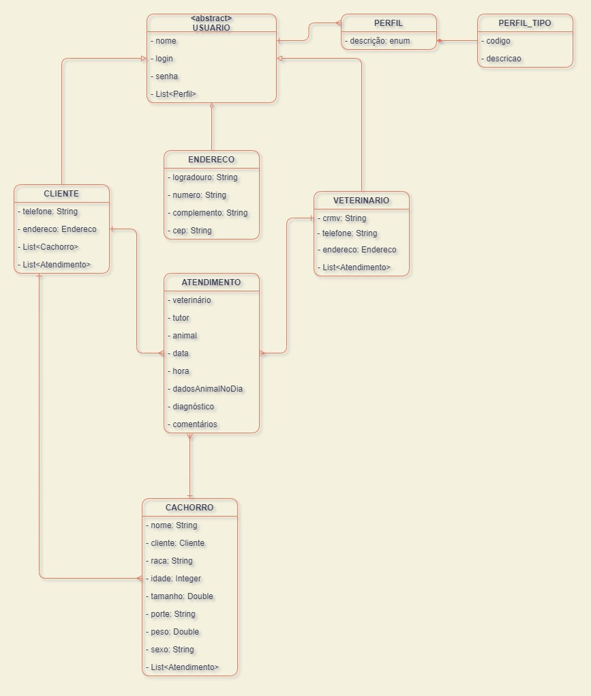
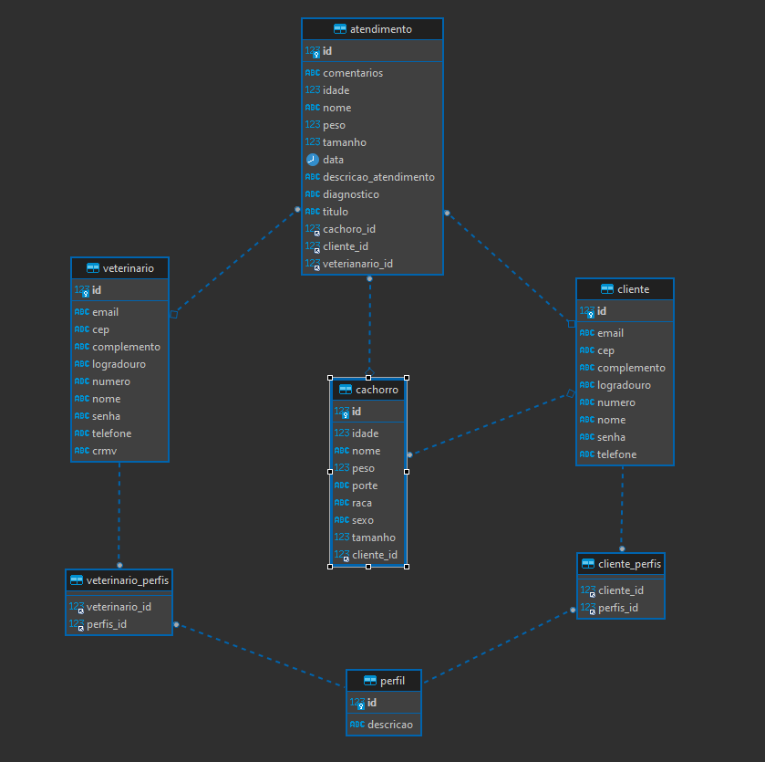

## CLINICA VETERINÁRIA - REST API

## Descrição
Criar uma API REST simulando o funcionamento de uma clínica veterinária.

## Ferramentas utilizadas:
> - Linguagem Java
> - JDK 17
> - Spring Boot
> - Spring Data JPA
> - Spring Validation
> - Spring Security
> - Spring Web
> - Spring Dev Tools
> - MySQL
> - Lombok
> - Maven
> - JUnit 5
> - Mockito
> - ModelMapper
> - JWT
> - Visual Studio Code
> - Git
> - Postman

## Instalação
<ol>
    <li> Utilizando o Git, execute o seguinte comando no terminal:<br><code> git clone https://git.gft.com/desafioapigft/desafioapigrupo3 </code><br></li>
    <li>Abra a pasta do projeto no Visual Studio Code ou abra pela IDE de sua preferência através do <code>pom.xml</code>, lembrando de instalar o Lombok</li>
    <li>Deverá ser feita a modificação do USER e PASSWORD no arquivo <br>"application.properties"</li>    
</ol>

### PROJETO POSTMAN

Link [Projeto Postman](https://git.gft.com/desafioapigft/desafioapigrupo3/-/tree/main/projeto-postman)

#### USO dos *endpoints*:
> 1. Gerar Token (ADMIN, CLIENTE ou VETERINARIO)
> 2. Copiar Token
> 3. Acessar a aba Authorization
> 4. Selecionar o Type -> Bearer Token
> 5. Colar Token no campo Token

### Atenção! 
#### Alterar os valores de USER e PASSWORD no application.properties para o usuário e senha do MySQL da sua máquina.


## Uso da Clinica API

### Endpoints:
> - Autenticação:<br>
>```POST http://localhost:8080/v1/auth```
> - Cliente:<br>
> >Salvar: ```POST http://localhost:8080/v1/clientes```<br>
> >Buscar: ```GET http://localhost:8080/v1/clientes/{id-do-cliente}```<br>
> >Listar: ```GET http://localhost:8080/v1/clientes?size=10&sort=nome,desc```<br>
> >Editar: ```PUT http://localhost:8080/v1/clientes/{id-do-cliente}```<br>
> >Excluir: ```DEL http://localhost:8080/v1/clientes/{id-do-cliente}```<br>
> >Buscar Histórico de Atendimento:
> - Veterinário:<br>
> >Salvar: ```POST http://localhost:8080/v1/veterinarios```<br>
> >Buscar: ```GET http://localhost:8080/v1/veterinarios/{id-do-veterinario}```<br>
> >Listar: ```GET http://localhost:8080/v1/veterinarios```<br>
> >Editar: ```PUT http://localhost:8080/v1/veterinarios/{id-do-veterinario}```<br>
> >Excluir: ```DEL http://localhost:8080/v1/veterinarios/{id-do-veterinario}```<br>
> - Cachorro:<br>
> >Salvar: ```POST http://localhost:8080/v1/cachorros?cliente={id-do-cliente}```<br>
> >Buscar: ```GET http://localhost:8080/v1/cachorros/{id-do-cachorro}```<br>
> >Listar: ```GET http://localhost:8080/v1/cachorros```<br>
> >Editar: ```PUT http://localhost:8080/v1/cachorros/{id-do-cachorro}```<br>
> >Excluir: ```DEL http://localhost:8080/v1/cachorros/{id-do-cachorro}```<br>
> - Atendimento:<br>
> >Salvar: ```POST http://localhost:8080/v1/atendimentos?veterinario={id-do-veterinario}&cliente={id-do-cliente}&cachorro={id-do-cachorro}```<br>
> >Buscar: ```GET http://localhost:8080/v1/atendimentos/{id-do-atendimento}```<br>
> >Listar: ```GET http://localhost:8080/v1/atendimentos```<br>
> >Editar: ```PUT http://localhost:8080/v1/atendimentos/{id-do-atendimento}```<br>
> >Excluir: ```DEL http://localhost:8080/v1/atendimentos/{id-do-atendimento}```<br>
> - Endpoints disponibilizados da DogAPI:
> >Busca por nome da raça: ```GET http://localhost:8080/v1/dogapi/{nome-da-especifico-raca}```<br>
> >Buscar todas as raças ```GET http://localhost:8080/v1/dogapi/listarTodasRacas```<br>
> >Buscar imagens de todas as raças```GET http://localhost:8080/v1/dogapi/ImagemTodasRacas```<br>
> >Buscar imagem específica da raça```GET http://localhost:8080/v1/dogapi/ImagemRaca/{nome-da-especifico-raca}```<br>
### UML Inicial

### UML Final

## Autores

Douglas Barcellos
Jardel Moraes
Josimar de Sousa
Leonardo Messias
Pedro Oliveira

## Licença
>#### MIT

## Status do Projeto
> - Em desenvolvimento
